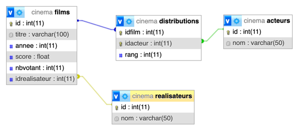

# TD 3 - Base de données Cinema 

## Objectif
Ecrire des requêtes de selection spécifiques sur la base de données définit par le schema suivant

## Installation
- Cloner le projet
- Démarrage des conteneurs docker docker compose up -d

## Requêtes à effectuer

1.	Liste des acteurs (nom) triée par ordre alphabétique.
2.	Liste des films (titre, année) du réalisateur « Martin Scorsese »
3.	Liste des films (titre) de l’année 1995 ayant obtenu un score supérieur à 8.6
4.	Liste des films (titre) dont l’année de sortie est comprise entre 1927 et 1933
5.	Liste des acteurs (nom + rang) ayant joués dans un film de « Sergio Leone » triée sur le rang
6.	Le nombre d’acteurs ayant joués dans le film « Pulp Fiction »
7.	Le nom du film ayant le moins de votants
8.	Le nom du film ayant le score le plus élevé
9.	Le nombre de films par réalisateur (nom) trié du plus grand au plus petit
10.	Le nombre de films par réalisateur (nom) pour ceux qui en ont réalisés plus de 4
11.	Le nombre de films joués par « Tom Hanks » entre 1990 et 2000 regroupés par année
12.	Liste des acteurs (nom) qui ont joué dans un film réalisé par « Stanley Kubrick » dont le nom commence par la lettre « J »
13.	Quelle est la moyenne (score) des films réalisés par « Alfred Hitchcock »
14.	Liste des réalisateurs qui n’ont pas tourné en 2005
15.	Liste des films (titre) dont le nombre de votants est supérieur à la moyenne des votants de l’ensemble des films
16.	Quel est le nom de l’acteur qui a été le plus souvent au rang 1
17.	Depuis combien de temps (titre + nombre d’années) chaque film est sorti
18.	Quel est le nom du film le plus vieux
19.	Quel est le nom du film ayant le plus d’acteurs

